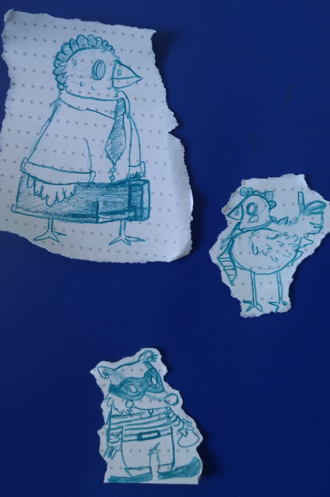
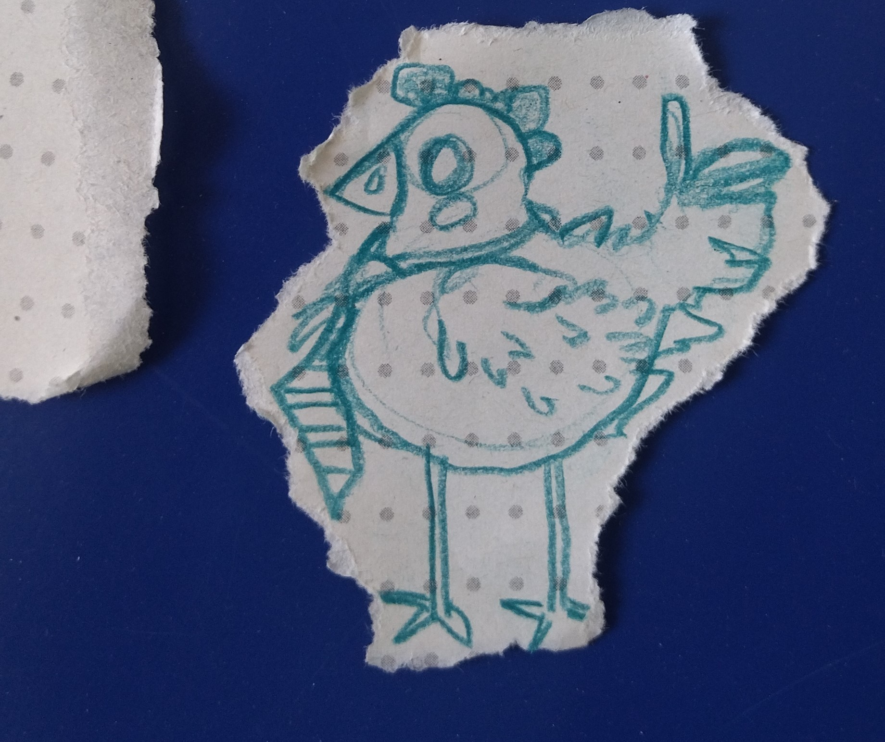
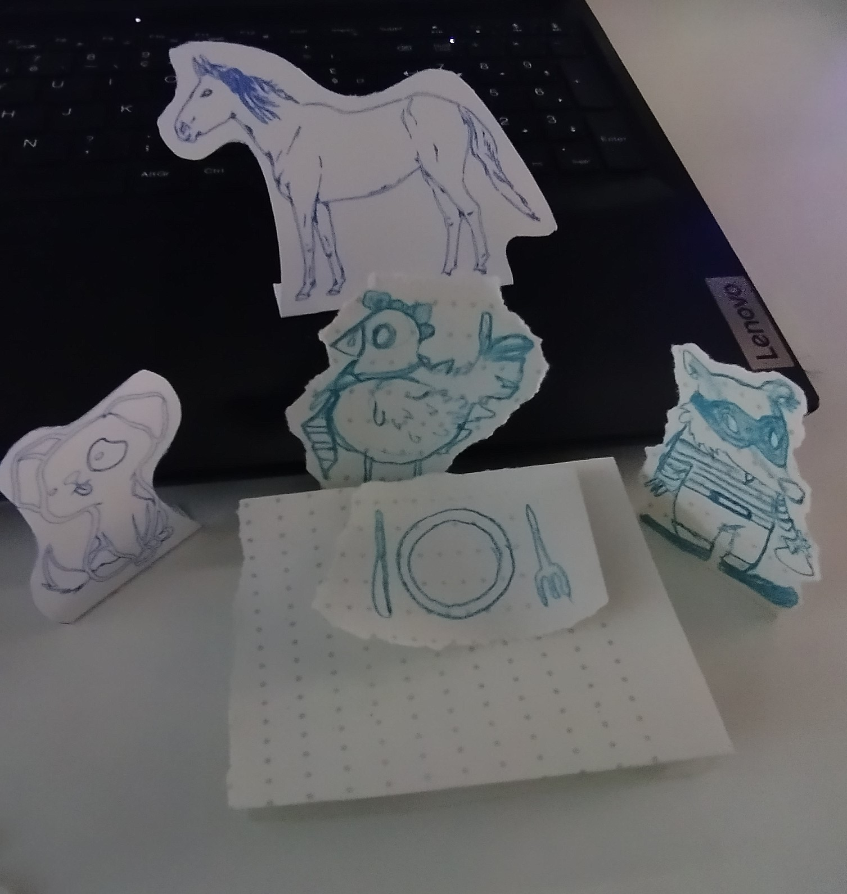
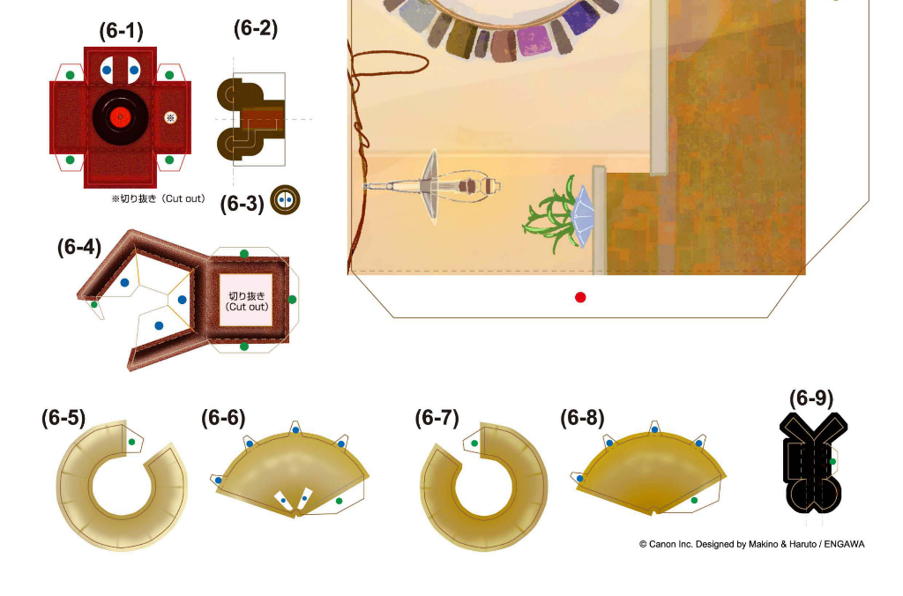

## 2023 May 10

We changed a bit the pitch and precised the story we wanted to tell while unfolding this haunted house. We decided to tell the story of a chase between a robber and the owner of the house. The two of them being a badger and an hen. Both of them end up trapped by the tricky architecture.

For the maquette, we also chose the type of paper we decided to use and printed some cutout example of a house.

