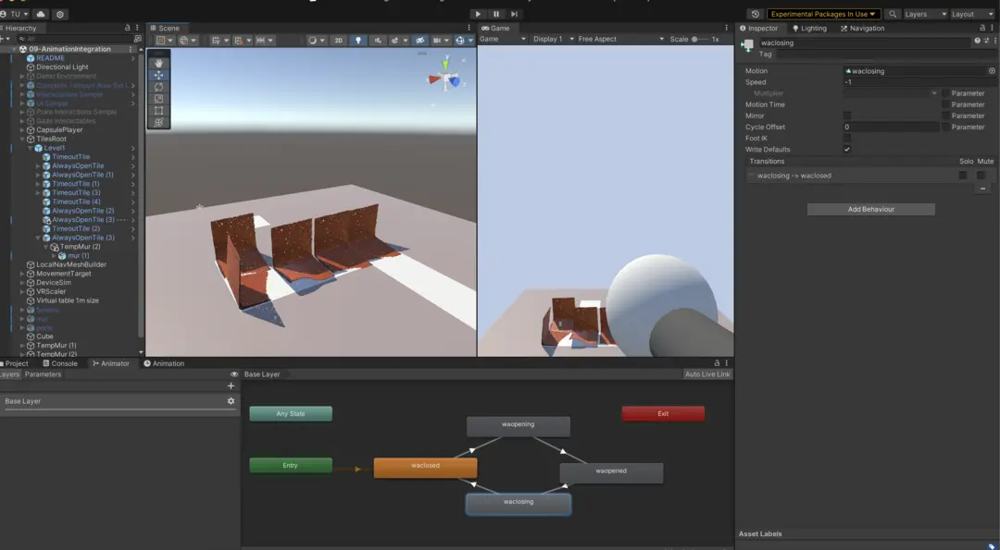

## 2023 June 08 - Integration and size fixing

We had a lot of issues with Unity navmesh sizing, we tried scaling everything VR by 10x, this way we can leave our tiles at units of 1 and not break the navmesh system.

Integrating with the animations is working, but their origin and size is incorrect for now. 

It also looks kind of gross at the moment.

