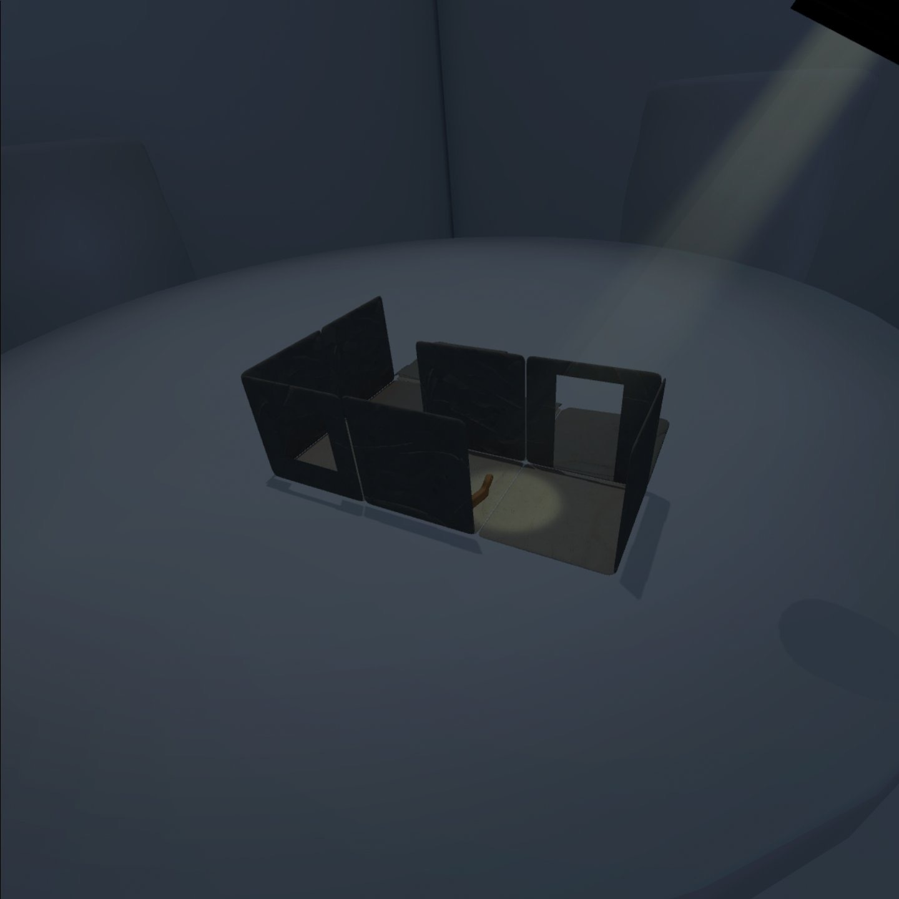
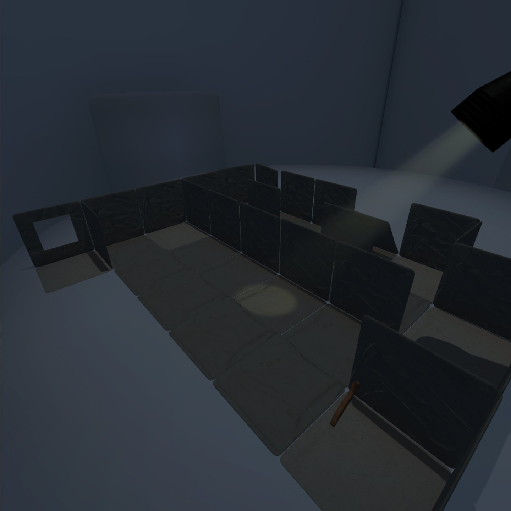
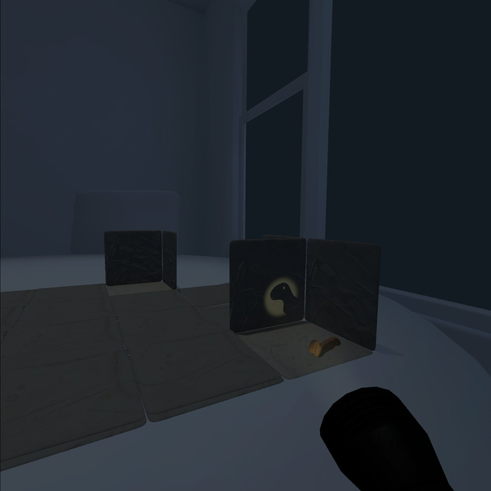

# Creepy cutouts-Documentation

Tibor Udvari & Faustine Périllaud

Guide the creature through a folding  environment and discover it's many paths.

 Pitch : 
 
 Embark on an adventure with Cricri, our lovable hero, as they navigate their first night in an unfamiliar home. As the cloak of night falls, a haunting presence emerges. Your perspective becomes Cricri's compass - they respond to your every glance and focus. The homestead begins to exhibit a surreal autonomy, reshaping itself in response to your watchful eye. Its intent grows more sinister - to imprison Cricri within its labyrinthine confines. Doors violently close, rooms expand and contract, and stairways twist into unexpected routes. Your task is paramount: guide Cricri through this perplexing maze, ensuring their safe departure.

Technical requirements : 
 - Meta Quest 2
 - right controller
 - Stationnary 

Main image : 

Secondary image : 

